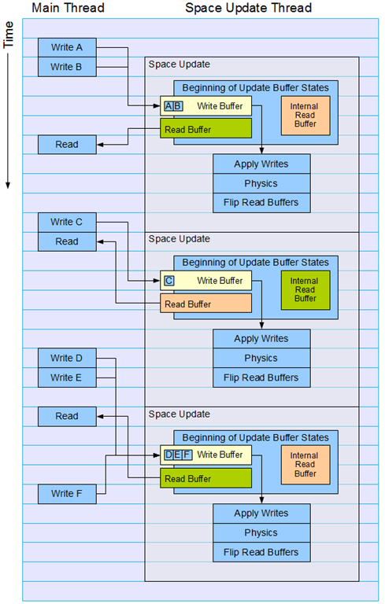
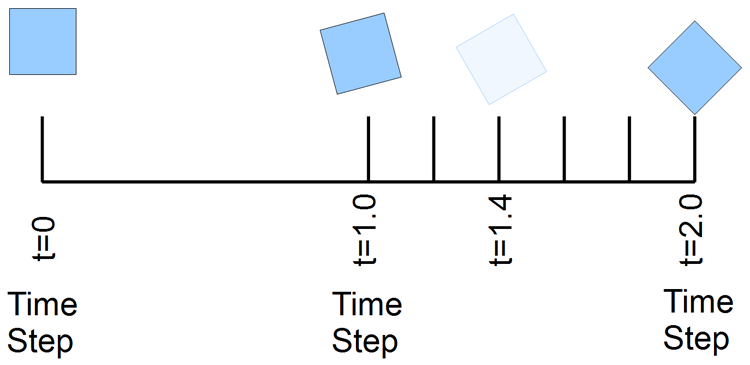
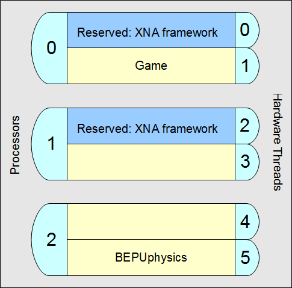

# **Updating Asynchronously**

Managing BEPUphysics running on a separate thread.

[Updating Asynchronously Demo](Isolated Demos/UpdatingAsynchronouslyDemo)

## **1 | Getting Started**
BEPUphysics can be run in a separate thread while your game and rendering run in others. The process to get started is simple: call update from another thread, passing the elapsed time between updates into the Space.Update method.

### 1.A | Enabling Internal Time Stepping
Calling a single full timestep every single loop iteration would result in the simulation running at some timescale defined by how long it takes to finish a simulation time step. Instead, the engine can step forward only as much as necessary.

This is accomplished through passing the time since the last frame as a parameter to the space's update method.

Internally, the engine will perform a series of time steps of length equal to the Space.TimeStepSettings.TimeStepDuration. For example, if 1/30th of a second has passed since the last update call and the TimeStepDuration is 1/60th of a second, the update method will perform two timesteps to 'catch up' to real time.

Occasionally the simulation will run too slow for it to catch up to real time. To prevent it from entering into a vicious cycle of taking longer and longer to update, there is a maximum number of time steps which are performed before 'giving up' and trying again in the next space update. This can be configured in the space's Space.TimeStepSettings.MaximumTimeStepsPerFrame; it defaults to 3.

### 1.B | Setting Up a Separate Thread
The engine can be run asynchronously by calling the space's update method from within an infinite loop. The method containing this physics update loop can be passed as a ThreadStart delegate to a Thread's constructor. When the thread's Start method is called, the loop will begin and the physics will start to update.

Since the engine must know how much time is passing, the current time should be recorded at the beginning of each iteration. The difference between the current time and the last recorded current time is passed into the space's update function.

## **2 | Buffering**
Entities have multiple kinds of state properties. The most direct ones are Entity.Position, Entity.Orientation, etc.; these are unbuffered. Reads and writes to these properties access the actual, current values. This type of access is dangerous if the engine is being updated asynchronously. This is where the buffered states come in. They can be accessed from the Entity.BufferedStates property if the Space.BufferedStates manager is enabled (it is disabled by default).

Buffered properties read from a buffer that flips after each space update completes and write to a write buffer which is flushed at the beginning of each space update.

Buffered properties are thread safe, allowing multiple threads to read from and write to them simultaneously. None of the interactions with buffered properties will interfere with the updating of the engine. The following example shows how the main thread's reads and writes interact with the space update thread's buffering systems.

Writes to buffered properties accumulate in the write buffer until the space update hits the “Apply Writes” stage. Buffered reads check the current visible buffer while the other buffer is internally updated with more current information. The “Flip Read Buffers” stage acquires a lock (see the next section) and switches the positions of the read buffers.

As a side effect of being buffered, writing to such properties will not have an immediate effect. It will be applied at the beginning of the next frame. Each write onto a property overwrites any previous write to that same property in the buffer. If an Entity does not belong to a Space, the buffered properties simply access the internal values.

### 2.A | Buffered States Manager
The buffered states of an entity are stored in arrays serving as buffers which are indexed using the Entity.BufferedStates.MotionStateIndex property.

In order to safely get rendering data, the internal buffer needs to be locked and copied into a list or array. The brief lock prevents the engine from swapping the buffers in the middle of a read, which would otherwise cause an occasional 'tearing' effect where half of the rendered entities would use one time step's values and the other half would use the next time step's values.

To make this process easier, the Space has a BufferedStatesManager accessible in its BufferedStates property. The BufferedStatesManager’s InterpolatedStates and ReadBuffers each have GetStates functions which internally lock and copy motion state data.

There is also a FlipLocker object exposed in the BufferedStatesManager’s submanagers. The engine internally locks these objects before flipping the buffer. The GetStates method also internally locks this object before gathering information, preventing the engine from flipping the buffers mid-read. If a method other than the GetStates method is used, the exposed locker object can still be locked to prevent the engine from flipping the buffers.

### 2.B | Interpolation
The BufferedStatesManager’s interpolated states (also accessible from the Entity.BufferedStates.InterpolatedStates property) all include an interpolated component when the space is using internal time stepping.

Interpolation fills in the gaps between frames. Frequently, when the physics thread's loop calls the space's update method, not enough time has elapsed since the previous time step to warrant another time step. Rather than do nothing and give the other systems jerky states, the last two time steps' results are blended together to form an intermediate state.

The amount of the previous and current states to use is defined by the amount of time that has built up since the last time step. For example:

*   If the time step duration is 0.016667 seconds,

*   and a total of 0.006667 seconds have elapsed since the last time step

*   the amount of the current state to use is 0.006667 / 0.016667 = 0.4,

*   and the amount of the previous state to use is 1 – 0.006667 / 0.016667 = 0.6.

These amounts are used in simple linear interpolation to blend the position, while the orientation is blended using spherical linear interpolation.

## **3 | Thread Interaction**
While on Windows the thread scheduler will generally be able to resolve the placement and scheduling of threads, the Xbox360 will need a more hands-on approach. The engine should not be running on the same core as other intensive tasks to avoid stalling the physics. For example, here is one possible configuration:

To define where the physics loop executes, Thread.CurrentThread.SetProcessorAffinity can be called from the beginning of the physics loop method.

It is possible to use internal multithreading in combination with asynchronous updates. Any cores that are left unused by other systems can be given to the engine for multithreading. Using a similar example to the above:

*   The rest of the game runs on hardware thread 1

*   The physics loop thread has an affinity set to hardware thread 3

*   The engine has two threads with affinities for hardware threads 3 and 5

Refer to the [Internal Multithreading](InternalMultithreading.md) documentation for more information on using internal multithreading and threading on the PC and Xbox360.

(Are you a user still targeting Xbox360? You should probably send me a message so I don't break something thinking no one is targeting it anymore.)

### 3.A | SpaceObjectBuffer
Since directly adding to and removing objects from the space using the main thread is not permitted while the engine is running asynchronously, the Space.SpaceObjectBuffer gives an interface for buffering up space objects to add or remove. It uses a brief busy lock to enqueue the objects, and then dequeues the objects at the beginning of each space timestep. This could be also be done without using the SpaceObjectBuffer; it’s just there for convenience.